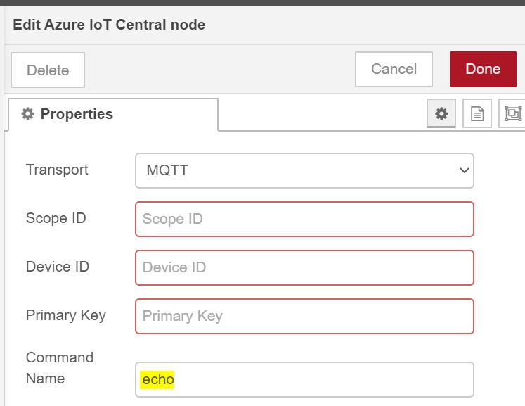
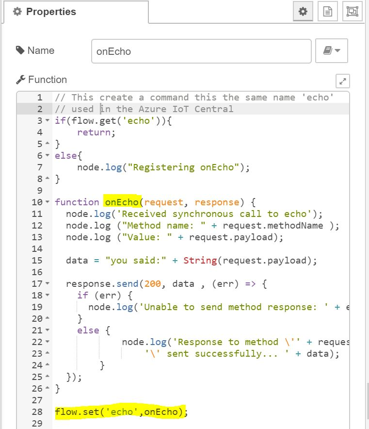
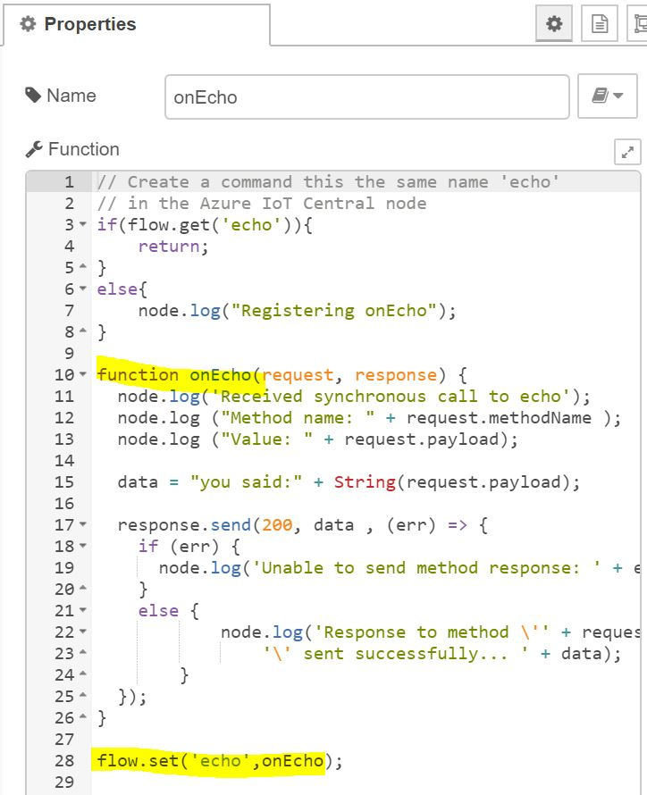
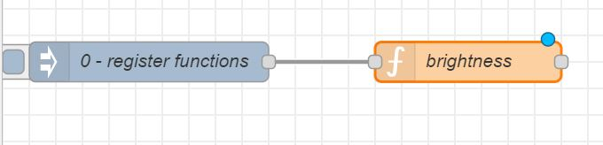
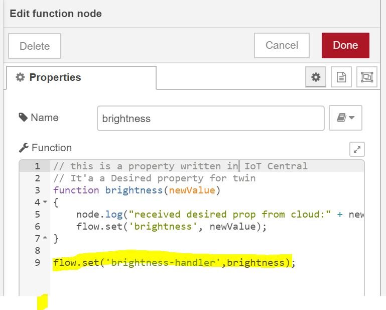

# Node-Red Azure IoT Central connector 
This node allows you easily connect your node red project to Azure IoT Central, providing the Scope ID, Device ID and Primary Key created in Azure IoT Central portal for a specific Device.

This connector supports MQTT, AMQP, HTTP as transport. 

Telemetry sent from your device to the cloud.

Commands from IoT Central (up to 5 ) to the device. For this scenario you have to use the method name used in IoT Central, and fill the properties tab of the connector, then define a Javascript function with the same name in your Node Red flow.

 

The Javascript function must be registered at the flow context and invoked before calling the connector. In the sample a simple inject is used, but you can do in other ways. 

The connector support desired properties (Cloud (W)->device(R)) and reported properties (Device(W)->Cloud (R)).

To react to a desired properties you have to register a Javascript function at the flow level and invoke it before calling the connector.

## Install

    npm install node-red-contrib-azure-iot-central

